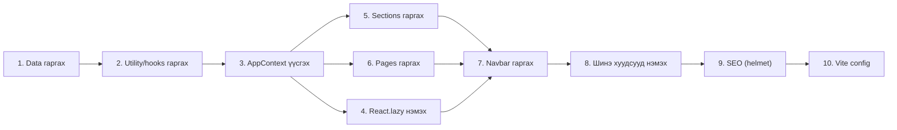

# Frontend Refactor — Архитектурын баримт бичиг

_www.scm.mn | frontend/ | React 19 + Vite 7 + Tailwind 3_
_Огноо: 2026-10-07_

---

## 1. Одоогийн архитектурын зураглал

### 1.1 App.jsx монолит (1601 мөр)

```
App.jsx
  |-- Мөр 1-42:     import-ууд (14 компонент, 23 lucide icon, 7 зураг)
  |-- Мөр 43-101:   Тогтмолууд (USE_LOCAL_IMAGES, FINANCIAL_DATE, helper fn)
  |-- Мөр 103-120:  API_URL, BACKGROUNDS объект
  |-- Мөр 122-131:  SECTION_RAINBOW_COLORS
  |-- Мөр 132-242:  blogPosts[], productsData[] (inline data — ~110 мөр)
  |-- Мөр 248-334:  OrgCard, Connector, OrgChart компонент (inline)
  |-- Мөр 337-387:  governanceItems[] (inline data)
  |-- Мөр 389-411:  BackButton, ScrollDownArrow (inline utility компонент)
  |-- Мөр 421-883:  Page компонентууд (inline):
  |     |-- UnderConstructionPage
  |     |-- GovernanceDetail
  |     |-- PromotionDetail
  |     |-- ProductDetail (~180 мөр)
  |     |-- ChatInfoDetail
  |     |-- FinancialReportsPage
  |     |-- PoliciesPage
  |-- Мөр 885-1199: App() функц — state, effects, routing logic
  |-- Мөр 1200-1601: App() JSX — nav, view routing (ternary chain), sections
```

### 1.2 State management

App() дотор 8 useState, бүгд props-оор дамжуулагддаг:

| State | Хэрэглэдэг компонент |
|-------|---------------------|
| `currentView` | Nav, BackButton, бүх page, ChatBot |
| `cfg` | Hero, About, Financials, Contact section |
| `products` | Nav submenu, Products section, ProductDetail, ChatBot |
| `promotions` | PromotionSlider, PromotionDetail |
| `financialStats` | Financials section |
| `scrolled` | Nav |
| `mobileMenuOpen` | Nav |
| `selectedItem`, `selectedGovernance` | Page routing |
| `currentUser`, `authToken` | AdminPanel, Login |

### 1.3 Custom routing

`window.history.pushState` + `popstate` listener дээр суурилсан. React Router ашиглаагүй.

Routing-ийн гол хэсгүүд:
- `VIEW_PATHS` — view нэр -> URL зурагт (19 view)
- `getPath(view, item)` — dynamic URL (/products/:key, /promo/:slug, /governance/:slug)
- `pathToState(pathname, hash, prods, promos)` — URL -> state хөрвүүлэгч
- `navigateTo(view, item, govItem)` — navigation handler
- `scrollToSection(id)` — hash-based section scroll

Ternary chain (мөр 1318-1593): 14 нөхцөл -> view render.

### 1.4 Бүрэлдэхүүний диаграм (одоо)

```mermaid
graph TD
    main["main.jsx"]
    app["App.jsx (1601 мөр)"]

    main --> app

    subgraph "App.jsx дотор inline"
        data["productsData, blogPosts, governanceItems"]
        orgChart["OrgChart, OrgCard, Connector"]
        pages["ProductDetail, GovernanceDetail, PromotionDetail, FinancialReportsPage, PoliciesPage, ChatInfoDetail, UnderConstructionPage"]
        nav["Navbar JSX"]
        sections["Hero, About, Financials, Governance, Products, Blog, Contact sections"]
        routing["VIEW_PATHS, pathToState, navigateTo, scrollToSection"]
        helpers["BackButton, ScrollDownArrow, getImage, hexToRgb, getSectionBackgroundStyle"]
    end

    app --> data
    app --> orgChart
    app --> pages
    app --> nav
    app --> sections
    app --> routing
    app --> helpers

    subgraph "components/ (тусдаа файл)"
        admin["AdminPanel (3273 мөр)"]
        loan["LoanRequest (936 мөр)"]
        trust["TrustRequest (145 мөр)"]
        onboard["CustomerOnboarding (364 мөр)"]
        chatbot["ChatBot (522 мөр)"]
        login["Login (105 мөр)"]
        blogList["BlogList"]
        promoSlider["PromotionSlider"]
        loanCalc["LoanCalculator"]
        trustCalc["TrustCalculator"]
        others["BoardMembers, ManagementTeam, ShareholderInfo, CEOContent, ShogunStudio, SafetyGuide, SafetyNotices, SafetyNoticesAdmin, LoanOrigination, LoanResearch, LoanExposureMonitor, PermissionMatrix, HeroSliderSettings, LoanApplicationDetail"]
    end

    app --> admin
    app --> loan
    app --> trust
    app --> onboard
    app --> chatbot
    app --> login
    app --> blogList
    app --> promoSlider
    app --> loanCalc
    app --> trustCalc
```



### 1.5 Bundle-ийн асуудлууд

1. **AdminPanel (3273 мөр)** — зочин хэрэглэгчид шаардлагагүй ч initial bundle-д орно
2. **LoanRequest (936 мөр)** — зөвхөн зээл хүсэгчид хэрэгтэй
3. **lucide-react CJS alias** — tree-shaking-ийг хааж, бүх icon-ыг bundle-д оруулна
4. **Бүх data/config** App.jsx-д inline — module-level evaluation

---

## 2. Хувилбар A: Incremental Extraction (Алхам-алхмаар хуваах)

### 2.1 Хэв маяг

Одоогийн custom routing-ийг хэвээр үлдээж, App.jsx-аас data, utility, page, section-уудыг файл руу нэг нэгээр нь гаргах. Context API нэмж, props drilling-ийг бууруулах.

### 2.2 Зорилтот файлын бүтэц

```
frontend/src/
  App.jsx                    (~200 мөр — routing + layout shell)
  main.jsx                   (HelmetProvider wrap нэмэгдэнэ)

  context/
    AppContext.jsx            (state + navigateTo + scrollToSection)

  router/
    paths.js                 (VIEW_PATHS, PRODUCT_KEY_MAP)
    pathToState.js           (URL -> state parser)

  data/
    products.js              (productsData, PRODUCT_KEY_MAP)
    blogPosts.js             (blogPosts)
    governanceItems.js       (governanceItems)
    backgrounds.js           (BACKGROUNDS, SECTION_RAINBOW_COLORS)
    constants.js             (API_URL, IS_VERTICAL_HERO_LOGO, USE_GOLD_LOGO, FINANCIAL_DATE)

  hooks/
    useCmsData.js            (cfg, financialStats, products, promotions fetch)
    useScrolled.js           (scroll handler)
    useRouting.js            (popstate, initial path resolution)

  sections/
    HeroSection.jsx
    AboutSection.jsx
    FinancialsSection.jsx
    GovernanceSection.jsx
    ProductsSection.jsx
    BlogSection.jsx
    ContactSection.jsx
    FooterBar.jsx

  pages/
    ProductDetailPage.jsx
    GovernanceDetailPage.jsx
    PromotionDetailPage.jsx
    FinancialReportsPage.jsx
    PoliciesPage.jsx
    ChatInfoDetailPage.jsx
    PrivacyPolicyPage.jsx    (шинэ)
    TermsPage.jsx            (шинэ)
    NotFoundPage.jsx         (шинэ)

  components/
    Navbar.jsx               (одоогийн nav JSX)
    BackButton.jsx
    ScrollDownArrow.jsx
    OrgChart.jsx
    PdfViewer.jsx            (shared modal — FinancialReports, Policies хоёрт)
    SuspenseFallback.jsx     (lazy loading fallback)
    ... (одоогийн 24 компонент хэвээр)
```

### 2.3 AppContext interface

```js
// context/AppContext.jsx

const AppContext = React.createContext(null);

// Provider value:
{
  // --- Navigation ---
  currentView: string,           // 'home' | 'product_detail' | 'admin' | ...
  selectedItem: object | null,   // product, promotion гэх мэт
  selectedGovernance: object | null,
  navigateTo: (view, item?, govItem?) => void,
  scrollToSection: (sectionId: string) => void,

  // --- CMS Data (read-only) ---
  cfg: object,                   // /api/config/flat-аас ирсэн тохиргоо
  products: Product[],           // productsData + DB merge
  promotions: Promotion[],
  financialStats: FinancialStat[],

  // --- Auth ---
  currentUser: object | null,
  authToken: string | null,
  handleLoginSuccess: (user, token) => void,
  handleLogout: () => void,

  // --- UI ---
  scrolled: boolean,
  mobileMenuOpen: boolean,
  setMobileMenuOpen: (val: boolean) => void,

  // --- Theme ---
  themeMode: 'dark' | 'light',
  themeType: 'default' | 'color' | 'image',
  overlayRgb: string,
  oMul: number,
  getSectionBackgroundStyle: (sectionKey, defaultImage, options?) => CSSProperties,
  isLight: boolean,
}
```

### 2.4 Аюулгүй хуваах дараалал



| Алхам | Файлууд | Хамаарал | Эрсдэл | Build шалгалт |
|-------|---------|----------|--------|---------------|
| 1. Data гаргах | `data/*.js` | Байхгүй | Бага — export/import | `npm run build` |
| 2. Utility гаргах | `hooks/*.js`, `router/*.js` | Data | Бага | `npm run build` |
| 3. AppContext | `context/AppContext.jsx` | Data, hooks | **Дунд** — бүх state нэг дор шилжих | Build + гар тест (nav, scroll, data) |
| 4. React.lazy | App.jsx-д 4 import солих | Байхгүй | Бага — Suspense fallback | Build + lazy comp-ууд нээгдэх тест |
| 5. Sections гаргах | `sections/*.jsx` | AppContext | Дунд — JSX хөдөлгөх | Build + visual regression |
| 6. Pages гаргах | `pages/*.jsx` | AppContext | Дунд | Build + бүх page нээгдэх тест |
| 7. Navbar | `components/Navbar.jsx` | AppContext | Бага | Build + nav тест |
| 8. Шинэ хуудсууд | `pages/PrivacyPolicy.jsx` г.м. | Router, AppContext | Бага — шинэ код | Build |
| 9. react-helmet-async | `main.jsx`, pages | Байхгүй | Бага | Build + title шалгах |
| 10. Vite config | `vite.config.js` | Байхгүй | **Дунд** — chunk conflict | Build + bundle size |

### 2.5 Давуу / Сул тал

| Давуу тал | Сул тал |
|-----------|---------|
| Алхам бүр тусдаа commit, rollback хялбар | Олон PR, удаан хугацаа |
| Regression хянах хялбар | Context шилжилт нь ажлын хамгийн том хэсэг |
| Одоогийн routing-ийг огт өөрчлөхгүй | Эцсийн бүтэц "бүрэн clean" биш (заримдаа хуучин pattern үлдэнэ) |
| Шинэ dependency бага (зөвхөн react-helmet-async) | — |

**Хөдөлмөрийн хэмжээ: M (7-10 хоног)**

---

## 3. Хувилбар B: Big-Bang Restructure (Нэг удаагийн бүтцийн өөрчлөлт)

### 3.1 Хэв маяг

App.jsx-ийг нэг удаад бүтэн задалж, бүх файлыг шинэ бүтцэд зэрэг шилжүүлнэ. Нэг PR.

### 3.2 Зорилтот бүтэц

Хувилбар A-тай ижил файлын бүтэц, гэхдээ бүгдийг нэг удаа хийнэ.

### 3.3 Давуу / Сул тал

| Давуу тал | Сул тал |
|-----------|---------|
| Нэг PR — "цэвэр" эхлэл | **Regression эрсдэл маш өндөр** — 1601 мөр нэг дор хөдөлнө |
| Хуучин pattern огт үлдэхгүй | Code review хэцүү (1 PR ~2000 мөр diff) |
| Хурдан дуусна (хэрэв алдаа гарахгүй бол) | Rollback бол бүгдийг буцаах |
| — | QA маш их шаардана (бүх page, navigation, section, mobile, theme) |

**Хөдөлмөрийн хэмжээ: M (4-5 хоног) + QA-д L хэмжээний ачаалал**

---

## 4. Санал болгож буй хувилбар: A (Incremental Extraction)

### 4.1 Шалтгаан

- Production сайт (www.scm.mn) — зочдод downtime болохгүй
- Тест suite байхгүй (unit тест алга) — гар тестээр шалгах шаардлагатай
- Монолит 1601 мөр — нэг удаад задлах нь regression өндөртэй
- Алхам бүрийг commit-лэн, deploy-д итгэлтэй явна

### 4.2 Хийгдэх файлуудын бүрэн жагсаалт

**Шинээр үүсгэх:**

| Файл | Хэмжээ (ойролцоо) | Эх |
|------|-------------------|-----|
| `src/data/products.js` | ~120 мөр | App.jsx мөр 167-242 |
| `src/data/blogPosts.js` | ~35 мөр | App.jsx мөр 132-165 |
| `src/data/governanceItems.js` | ~55 мөр | App.jsx мөр 337-387 |
| `src/data/backgrounds.js` | ~30 мөр | App.jsx мөр 111-131 |
| `src/data/constants.js` | ~15 мөр | App.jsx мөр 65-69, 106 |
| `src/router/paths.js` | ~25 мөр | App.jsx мөр 919-935 |
| `src/router/pathToState.js` | ~35 мөр | App.jsx мөр 937-965 |
| `src/hooks/useCmsData.js` | ~65 мөр | App.jsx мөр 994-1040 |
| `src/hooks/useScrolled.js` | ~12 мөр | App.jsx мөр 988-992 |
| `src/hooks/useRouting.js` | ~40 мөр | App.jsx мөр 1053-1082 |
| `src/context/AppContext.jsx` | ~80 мөр | state + provider |
| `src/components/Navbar.jsx` | ~100 мөр | App.jsx мөр 1242-1316 |
| `src/components/BackButton.jsx` | ~12 мөр | App.jsx мөр 389-398 |
| `src/components/ScrollDownArrow.jsx` | ~12 мөр | App.jsx мөр 400-411 |
| `src/components/OrgChart.jsx` | ~80 мөр | App.jsx мөр 248-334 |
| `src/components/PdfViewer.jsx` | ~20 мөр | shared modal |
| `src/components/SuspenseFallback.jsx` | ~15 мөр | loading UI |
| `src/sections/HeroSection.jsx` | ~55 мөр | App.jsx мөр 1355-1407 |
| `src/sections/AboutSection.jsx` | ~40 мөр | App.jsx мөр 1409-1436 |
| `src/sections/FinancialsSection.jsx` | ~45 мөр | App.jsx мөр 1438-1464 |
| `src/sections/GovernanceSection.jsx` | ~45 мөр | App.jsx мөр 1466-1496 |
| `src/sections/ProductsSection.jsx` | ~40 мөр | App.jsx мөр 1498-1528 |
| `src/sections/BlogSection.jsx` | ~25 мөр | App.jsx мөр 1531-1544 |
| `src/sections/ContactSection.jsx` | ~50 мөр | App.jsx мөр 1547-1592 |
| `src/pages/ProductDetailPage.jsx` | ~180 мөр | App.jsx мөр 524-701 |
| `src/pages/GovernanceDetailPage.jsx` | ~45 мөр | App.jsx мөр 445-486 |
| `src/pages/PromotionDetailPage.jsx` | ~40 мөр | App.jsx мөр 488-522 |
| `src/pages/FinancialReportsPage.jsx` | ~50 мөр | App.jsx мөр 781-831 |
| `src/pages/PoliciesPage.jsx` | ~50 мөр | App.jsx мөр 833-883 |
| `src/pages/ChatInfoDetailPage.jsx` | ~80 мөр | App.jsx мөр 703-779 |
| `src/pages/PrivacyPolicyPage.jsx` | ~шинэ | — |
| `src/pages/TermsPage.jsx` | ~шинэ | — |
| `src/pages/NotFoundPage.jsx` | ~шинэ | — |

**Өөрчлөгдөх:**

| Файл | Өөрчлөлт |
|------|----------|
| `src/App.jsx` | 1601 мөр -> ~200 мөр (routing shell, lazy imports, AppProvider) |
| `src/main.jsx` | `HelmetProvider` wrap нэмэх |
| `vite.config.js` | lucide-react CJS alias устгах, manualChunks нэмэх |
| `package.json` | `react-helmet-async` dependency нэмэх |

---

## 5. Vite Config өөрчлөлт

### 5.1 lucide-react CJS alias устгах

```js
// vite.config.js — ӨМНӨ
resolve: {
  alias: {
    '@shared': path.resolve(__dirname, '../shared'),
    'react/jsx-runtime': path.resolve(__dirname, 'node_modules/react/jsx-runtime.js'),
    react: path.resolve(__dirname, 'node_modules/react'),
    'lucide-react': path.resolve(__dirname, 'node_modules/lucide-react/dist/cjs/lucide-react.js'),
  },
},

// vite.config.js — ДАРАА
resolve: {
  alias: {
    '@shared': path.resolve(__dirname, '../shared'),
    'react/jsx-runtime': path.resolve(__dirname, 'node_modules/react/jsx-runtime.js'),
    react: path.resolve(__dirname, 'node_modules/react'),
    // lucide-react CJS alias УСТГАСАН — Vite 7 ESM tree-shaking автоматаар ажиллана
  },
},
```

### 5.2 Manual chunks

```js
build: {
  rollupOptions: {
    output: {
      manualChunks: {
        'vendor-react': ['react', 'react-dom'],
        'vendor-lucide': ['lucide-react'],
        'vendor-axios': ['axios'],
      },
    },
  },
  target: 'es2020',
},
```

> `admin` болон `loan-form` chunk-ийг тусдаа зааж өгөхгүй — `React.lazy` автоматаар тусдаа chunk үүсгэнэ. Manual chunks зөвхөн vendor library-д хэрэгтэй.

### 5.3 React.lazy (App.jsx дахь өөрчлөлт)

```js
// ӨМНӨ (static import):
import AdminPanel from './components/AdminPanel';
import LoanRequest from './components/LoanRequest';
import TrustRequest from './components/TrustRequest';
import CustomerOnboarding from './components/CustomerOnboarding';

// ДАРАА (lazy import):
const AdminPanel = React.lazy(() => import('./components/AdminPanel'));
const LoanRequest = React.lazy(() => import('./components/LoanRequest'));
const TrustRequest = React.lazy(() => import('./components/TrustRequest'));
const CustomerOnboarding = React.lazy(() => import('./components/CustomerOnboarding'));

// Render хэсэгт Suspense wrap:
<Suspense fallback={<SuspenseFallback />}>
  {currentView === 'admin' ? <AdminPanel ... /> : ...}
</Suspense>
```

**Хүлээгдэж буй bundle хэмнэлт:**

| Компонент | Мөр | Ойролцоо chunk хэмжээ |
|-----------|-----|----------------------|
| AdminPanel | 3273 | ~80-120 KB (gzip) |
| LoanRequest | 936 | ~25-35 KB |
| TrustRequest | 145 | ~4-6 KB |
| CustomerOnboarding | 364 | ~10-15 KB |
| **Нийт initial bundle-аас хасагдах** | | **~120-175 KB** |

---

## 6. SEO: react-helmet-async

### 6.1 main.jsx

```jsx
import { HelmetProvider } from 'react-helmet-async';

createRoot(document.getElementById('root')).render(
  <StrictMode>
    <HelmetProvider>
      <App />
    </HelmetProvider>
  </StrictMode>,
);
```

### 6.2 Хуудас бүрийн title/description загвар

| View | Title | Description |
|------|-------|-------------|
| home | Solongo Capital ББСБ - Бизнесийн өсөлтийг дэмжинэ | Зээл, итгэлцэл, кредит карт ... |
| product_detail | {product.title} \| Solongo Capital ББСБ | {product.shortDesc} |
| loan_request | Зээлийн хүсэлт \| Solongo Capital ББСБ | Онлайнаар зээлийн хүсэлт илгээх |
| trust_request | Итгэлцлийн хүсэлт \| Solongo Capital ББСБ | ... |
| calculator | Зээлийн тооцоолуур \| Solongo Capital ББСБ | ... |
| admin | Админ \| Solongo Capital | (noindex) |
| privacy-policy | Нууцлалын бодлого \| Solongo Capital ББСБ | ... |
| terms | Үйлчилгээний нөхцөл \| Solongo Capital ББСБ | ... |
| 404 | Хуудас олдсонгүй \| Solongo Capital ББСБ | (noindex) |

---

## 7. Шинэ хуудсууд

### 7.1 Routing нэмэлт

`VIEW_PATHS` болон `pathToState`-д нэмэгдэх:

```js
// router/paths.js
const VIEW_PATHS = {
  ...existing,
  privacy_policy: '/privacy-policy',
  terms: '/terms',
  not_found: '/404',
};
```

`pathToState` дотор бүх unknown path-ийг `not_found` view руу илгээнэ (одоо `home` руу буцаана).

### 7.2 Admin панелд Google Maps URL

`cfg.contact_maps_url` нэмэх — backend `/api/config` API-д шинэ key.

Contact section дахь hardcoded `https://goo.gl/maps/YOUR_LINK` -> `cfg.contact_maps_url || '#'`.

Admin panel-д "Холбоо барих" тохиргооны хэсэгт шинэ input field нэмнэ:
- Label: "Google Maps URL"
- Key: `contact_maps_url`
- Validation: URL format

---

## 8. Гүйцэтгэлийн анхаарах зүйлс

1. **Lazy chunk load failure** — Vercel CDN дээр deployment хоорондын chunk mismatch. Suspense errorBoundary нэмж, хэрэглэгчийг reload хийхийг санал болгох.

2. **CLS (Cumulative Layout Shift)** — SuspenseFallback нь lazy компонентийн хэмжээтэй ойролцоо байх (min-height тавих).

3. **lucide-react CJS alias устгасны дараа** — icon-ууд зөв render хийж байгааг шалгах. ESM import path зөв ажиллах ёстой гэхдээ хуучин lucide-react@0.562.0 version-ий ESM export-ийг `npm run build` ажиллуулж баталгаажуулах.

4. **Manual chunks + React.lazy conflict** — vendor-lucide chunk + lazy chunk-ийн давхцал гарвал `manualChunks`-аас `vendor-lucide`-ийг хасах. Build warning шалгах.

---

## 9. Аюулгүй байдал

1. **Auth token** — localStorage-д JWT хадгалж байгаа нь одоогийн pattern. XSS-ээс хамгаалах: `dangerouslySetInnerHTML` ашиглаагүй (сайн). CMS data-г HTML-ээр render хийж байвал sanitize хийх.

2. **API_URL** — production/localhost шалгалт `window.location.hostname`-аар → хэрэв proxy/tunnel ашиглавал буруу API руу чиглэнэ. Environment variable (`import.meta.env.VITE_API_URL`) руу шилжих нь дараагийн алхам, гэхдээ энэ refactor-ийн scope-д ороогүй.

3. **Шинэ хуудсууд** (privacy, terms) — Static content, аюулгүй байдлын шинэ эрсдэлгүй.

---

## 10. Observability

1. **Error boundary** — React.lazy компонентуудад ErrorBoundary нэмэх. Console error log + хэрэглэгчид "Алдаа гарлаа, дахин ачаалах" UI.

2. **Bundle size tracking** — `vite-bundle-visualizer` нэмж (devDependency), PR бүрт bundle хэмжээ хянах.

3. **Performance mark** — Шаардлагагүй (одоогоор Vercel Analytics ашиглаж байвал Web Vitals автоматаар ирнэ).

---

## 11. Regression эрсдэл ба шийдэл

| # | Эрсдэл | Магадлал | Нөлөө | Шийдэл |
|---|--------|----------|--------|--------|
| R1 | AppContext шилжилтийн үед props-ийн нэр өөрчлөгдөх | Дунд | Өндөр — UI эвдрэх | Context value-ийн нэршлийг одоогийн prop нэрстэй яг ижил хадгалах |
| R2 | Data файл гаргахад circular import | Бага | Дунд — build fail | data/ хоорондоо import хийхгүй, зөвхөн нэг чиглэлтэй |
| R3 | Section гаргахад scroll anchor (#about-intro) алдагдах | Дунд | Өндөр — nav эвдрэх | Section id-г яг хэвээр хадгалах, гар тест |
| R4 | React.lazy chunk network error | Бага | Дунд — хэрэглэгч хоосон хуудас | ErrorBoundary + retry |
| R5 | lucide-react CJS alias устгахад icon render fail | Бага | Өндөр — UI эвдрэх | Build + visual шалгалт, шаардлагатай бол alias буцаах |
| R6 | Vite manualChunks conflict | Бага | Дунд — build fail | Warning шалгаж, chunk тохиргоо засах |
| R7 | Theme system (overlay, isLight) Section рүү шилжихэд алдагдах | Дунд | Өндөр — visual эвдрэх | getSectionBackgroundStyle, overlay CSS-ийг App-д хэвээр үлдээх эсвэл context-ээр дамжуулах |
| R8 | ChatBot products context-гүйгээр ажиллахгүй болох | Бага | Дунд | ChatBot-д products-ийг context-ээр дамжуулах |
| R9 | Mobile menu state Section/Navbar хооронд sync алдах | Бага | Бага | mobileMenuOpen-ийг context-д хадгалах |
| R10 | SEO — react-helmet-async React 19 нийцтэй байдал | Бага | Дунд | npm install -> build -> dev тест. Ажиллахгүй бол v2.0.5 pin |

---

## 12. Шийдвэрлэх шаардлагатай асуултууд

1. **Google Maps URL backend schema** — `config` collection-д `contact_maps_url` key нэмэх үү, эсвэл тусдаа endpoint? (Санал: одоогийн flat config pattern дагах — зүгээр key нэмэх)

2. **Privacy/Terms агуулга** — Хуулийн зөвлөхөөс баталгаажуулах шаардлагатай юу? (Санал: placeholder хуудас үүсгэж, агуулгыг дараа нэмэх)

3. **404 хуудас** — unknown route бүрт `/404` redirect хийх үү, эсвэл URL хэвээр үлдээж NotFound render хийх? (Санал: URL хэвээр — redirect нь URL-ийг алдагдуулна)

4. **Bundle budget** — Initial JS bundle-ийн зорилтот хэмжээ тогтоох уу? (Санал: < 300KB gzip)

---

## Хавсралт: Хувилбаруудын харьцуулалт

| Шалгуур | A: Incremental | B: Big-Bang |
|---------|---------------|-------------|
| Regression эрсдэл | **Бага** | Өндөр |
| Хугацаа (coding) | 7-10 хоног | 4-5 хоног |
| QA ачаалал | Алхам тутам бага | Нэг удаад их |
| Rollback | Алхам бүрийг тусдаа | Бүгдийг буцаах |
| Code review | PR тус бүр жижиг | 1 PR ~2000 мөр |
| Эцсийн үр дүн | Ижил | Ижил |
| **Хөдөлмөрийн хэмжээ** | **M** | **M (coding) + L (QA)** |
| **Санал** | **Энийг сонгох** | Тест coverage өндөр бол |
