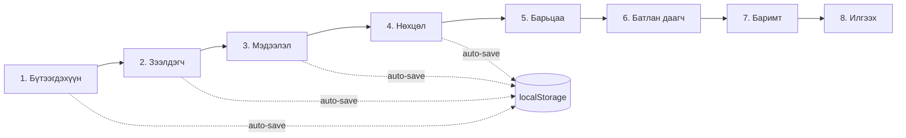

# Frontend UX Спецификаци — www.scm.mn
_Solongo Capital ББСБ · React 19 + Vite 7 + Tailwind 3_
_Огноо: 2026-10-07_

---

## Агуулга

1. [Дизайн систем — Лавлагаа](#1-дизайн-систем--лавлагаа)
2. [User Flow диаграм](#2-user-flow-диаграм)
3. [Skeleton Screens](#3-skeleton-screens)
4. [Breadcrumb Navigation](#4-breadcrumb-navigation)
5. [404 Хуудас](#5-404-хуудас)
6. [FAQ Хэсэг](#6-faq-хэсэг)
7. [Нууцлалын бодлого хуудас](#7-нууцлалын-бодлого-хуудас)
8. [Үйлчилгээний нөхцөл хуудас](#8-үйлчилгээний-нөхцөл-хуудас)
9. [Footer Trust Indicators](#9-footer-trust-indicators)
10. [Тооцоолуурын Disclaimer](#10-тооцоолуурын-disclaimer)
11. [LoanRequest форм — Progress Bar, Auto-save, Validation](#11-loanrequest-форм)
12. [File Upload UX](#12-file-upload-ux)
13. [Google Maps Admin тохиргоо](#13-google-maps-admin-тохиргоо)
14. [Skip Navigation Link](#14-skip-navigation-link)
15. [Accessibility Checklist](#15-accessibility-checklist)
16. [Нээлттэй асуултууд](#16-нээлттэй-асуултууд)

---

## 1. Дизайн систем — Лавлагаа

### Өнгөний токен

| Нэр | Одоогийн утга | Сайжруулалтын утга | Хэрэглэх газар |
|---|---|---|---|
| `--sc-green` / `#00A651` | Тексттэй хэрэглэхэд AA fail | `#007A3D` | Бүх ногоон текст, badge |
| `--sc-gold` / `#D4AF37` | AA pass (цагаан дээр) | Өөрчлөхгүй | Primary button, кичер |
| `--sc-navy` / `#062842` | Дэвсгэр | Өөрчлөхгүй | Card дэвсгэр |
| `--sc-deep` / `#041621` | Хамгийн гүн дэвсгэр | Өөрчлөхгүй | Page дэвсгэр |

> Тэмдэглэл: `#00A651` цагаан текстийн дээр ашиглахад контраст харьцаа 3.1:1 (AA шаардлага 4.5:1 биелэхгүй). `#007A3D` нь 5.2:1 өгдөг. CSS variables болон Tailwind config аль аль дээр шинэчлэх шаардлагатай.

### Одоогийн CSS классууд (өөрчлөлтгүй ашиглах)

```
.sc-glass-panel    — backdrop-blur, semi-transparent card
.sc-card-lift      — hover translateY(-6px) дэмжих card
.sc-primary-button — алт градиент товч (#062842 текст)
.sc-secondary-button — тунгалаг товч, алт border hover
.sc-kicker         — #D4AF37, uppercase, tracked label
```

### Типографи

- Гарчиг: Montserrat Bold/ExtraBold
- Текст: Montserrat Regular/Medium
- Кичер: Montserrat ExtraBold 0.72rem, tracking 0.18em, uppercase

### Focus дүрэм

```css
/* index.css-д байгаа — хэрэглэгч бүх interactive элементэд дага */
button:focus-visible,
a:focus-visible {
  outline: 2px solid rgba(212, 175, 55, 0.9);
  outline-offset: 4px;
}
```

---

## 2. User Flow диаграм

### 2.1 Зочины үндсэн урсгал

```mermaid
flowchart TD
    A([Нүүр хуудас]) --> B{Зорилго}
    B --> C[Бүтээгдэхүүн үзэх]
    B --> D[Тооцоолох]
    B --> E[Зээл хүсэх]
    B --> F[Мэдлэгийн сан]
    B --> G[Компанийн мэдээлэл]

    C --> C1[Бүтээгдэхүүний card]
    C1 --> C2[Дэлгэрэнгүй хуудас]
    C2 --> C3[Breadcrumb: Нүүр / Бүтээгдэхүүн / Зээлийн нэр]
    C2 --> E

    D --> D1[Тооцоолуур хэсэг]
    D1 --> D2[Үр дүн + Disclaimer]
    D2 --> E

    E --> E1[LoanRequest форм нээгдэх]
    E1 --> E2[Алхам 1: Бүтээгдэхүүн]
    E2 --> E3[Алхам 2–7: Мэдээлэл]
    E3 --> E4[Алхам 8: Илгээх]
    E4 --> E5{Амжилттай?}
    E5 -->|Тийм| E6[Баталгаажуулах дэлгэц]
    E5 -->|Алдаа| E7[Алдааны мэдэгдэл]

    F --> F1[BlogList]
    F1 --> F2[Нийтлэлийн дэлгэрэнгүй]
    F2 --> F3[Breadcrumb: Нүүр / Мэдлэгийн сан / Гарчиг]

    G --> G1[Засаглалын хуудас]
    G1 --> G2[Breadcrumb: Нүүр / Засаглал / Хэсэг]

    A --> H[FAQ хэсэг]
    A --> I[Footer]
    I --> I1[/privacy-policy]
    I --> I2[/terms]
    I --> I3[СЗХ лиценз харуулах]

    J([404]) --> A
```

### 2.2 Зээл хүсэгчийн форм урсгал



---

## 3. Skeleton Screens

### 3.1 BlogList Skeleton

**Хэрэглэх газар:** `BlogList.jsx` — `loading === true` үед spinner-ийг солих.

**Desktop wireframe (1 мөр, 4 багана):**

```
┌──────────────────────────────────────────────────────────────────┐
│  ████████████████████████████████████████████████████████████   │
│  (Нүүр хуудас / Мэдлэгийн сан breadcrumb skeleton)              │
│                                                                  │
│  ┌──────────┐  ┌──────────┐  ┌──────────┐  ┌──────────┐        │
│  │░░░░░░░░░░│  │░░░░░░░░░░│  │░░░░░░░░░░│  │░░░░░░░░░░│        │
│  │  зураг   │  │  зураг   │  │  зураг   │  │  зураг   │        │
│  │ 160px h  │  │ 160px h  │  │ 160px h  │  │ 160px h  │        │
│  ├──────────┤  ├──────────┤  ├──────────┤  ├──────────┤        │
│  │ ████████ │  │ ████████ │  │ ████████ │  │ ████████ │        │
│  │ ██████   │  │ ██████   │  │ ██████   │  │ ██████   │        │
│  │ ████     │  │ ████     │  │ ████     │  │ ████     │        │
│  └──────────┘  └──────────┘  └──────────┘  └──────────┘        │
└──────────────────────────────────────────────────────────────────┘
```

**Mobile wireframe (1 багана):**

```
┌────────────────────────┐
│  ┌──────────────────┐  │
│  │░░░░░░░░░░░░░░░░░░│  │
│  │    зураг 140px   │  │
│  ├──────────────────┤  │
│  │ ████████████████ │  │
│  │ ████████████     │  │
│  │ ████████         │  │
│  └──────────────────┘  │
│  ┌──────────────────┐  │
│  │ (давтагдана x3)  │  │
│  └──────────────────┘  │
└────────────────────────┘
```

**Бүрэлдэхүүн:**

```jsx
// Нэг BlogSkeleton card
<div className="sc-glass-panel rounded-2xl overflow-hidden animate-pulse">
  {/* Зургийн skeleton */}
  <div className="h-40 bg-white/10 rounded-t-2xl" />
  {/* Текстийн skeleton */}
  <div className="p-4 space-y-2">
    <div className="h-3 bg-white/10 rounded w-1/3" />   {/* эх сурвалж badge */}
    <div className="h-4 bg-white/10 rounded w-full" />  {/* гарчиг мөр 1 */}
    <div className="h-4 bg-white/10 rounded w-4/5" />   {/* гарчиг мөр 2 */}
    <div className="h-3 bg-white/10 rounded w-2/3" />   {/* огноо */}
  </div>
</div>
```

**Skeleton тоо:** desktop 4, tablet 2, mobile 1 (grid-ийн багануудтай тохируулна).

**Төлөвүүд:**

| Төлөв | UI |
|---|---|
| loading | 4 ширхэг skeleton card, `animate-pulse` |
| empty | "Мэдлэгийн сан хоосон байна" + ногоон дүрс (дор харна) |
| error | Улаан хүрээтэй мэдэгдэл + дахин ачаалах товч |
| success | Жинхэнэ card-ууд, animate-fade-in-up |

**Empty state:**

```
┌──────────────────────────────────────┐
│                                      │
│         [BookOpen icon 40px]         │
│                                      │
│     Одоогоор нийтлэл байхгүй байна   │
│                                      │
└──────────────────────────────────────┘
```

Tailwind: `flex flex-col items-center gap-4 py-16 text-white/40`

---

### 3.2 FinancialReports Skeleton

**Бүтэц:** Хүснэгтийн мөр бүрт skeleton.

```
┌───────────────────────────────────────────────────────┐
│  Жил        Тайлан          Татаж авах                │
│  ────────── ────────────── ─────────────              │
│  ░░░░░░     ░░░░░░░░░░░░░  ░░░░░░░░░░                 │
│  ░░░░░░     ░░░░░░░░░░░░░  ░░░░░░░░░░                 │
│  ░░░░░░     ░░░░░░░░░░░░░  ░░░░░░░░░░                 │
└───────────────────────────────────────────────────────┘
```

```jsx
// FinancialReportRowSkeleton — 5 мөр давтана
<tr className="animate-pulse border-b border-white/5">
  <td className="py-3 px-4"><div className="h-4 bg-white/10 rounded w-16" /></td>
  <td className="py-3 px-4"><div className="h-4 bg-white/10 rounded w-48" /></td>
  <td className="py-3 px-4"><div className="h-8 bg-white/10 rounded w-28" /></td>
</tr>
```

---

### 3.3 Admin Table Skeleton

**Бүтэц:** Хүснэгтийн header-г хэвээр үлдээж, мөр бүрийг skeleton-оор орлуулна.

```
┌──────────────────────────────────────────────────────────────────┐
│  №   Овог нэр      Бүтээгдэхүүн   Дүн        Огноо    Статус   │
│  ─── ──────────── ────────────── ─────────── ──────── ──────── │
│  ░░  ░░░░░░░░░░░  ░░░░░░░░░░░░░  ░░░░░░░░░  ░░░░░░░  ░░░░░░   │
│  ░░  ░░░░░░░░░░░  ░░░░░░░░░░░░░  ░░░░░░░░░  ░░░░░░░  ░░░░░░   │
│  ░░  ░░░░░░░░░░░  ░░░░░░░░░░░░░  ░░░░░░░░░  ░░░░░░░  ░░░░░░   │
└──────────────────────────────────────────────────────────────────┘
```

```jsx
// AdminTableSkeleton — 8 мөр
<tr className="animate-pulse border-b border-white/5">
  <td className="py-3 px-3"><div className="h-4 bg-white/10 rounded w-6" /></td>
  <td className="py-3 px-3"><div className="h-4 bg-white/10 rounded w-32" /></td>
  <td className="py-3 px-3"><div className="h-4 bg-white/10 rounded w-28" /></td>
  <td className="py-3 px-3"><div className="h-4 bg-white/10 rounded w-20" /></td>
  <td className="py-3 px-3"><div className="h-4 bg-white/10 rounded w-20" /></td>
  <td className="py-3 px-3"><div className="h-6 bg-white/10 rounded-full w-16" /></td>
</tr>
```

---

## 4. Breadcrumb Navigation

### 4.1 Визуал дизайн

**Desktop:**

```
Нүүр  /  Бүтээгдэхүүн  /  Бизнесийн зээл
[link]   [link]            [одоогийн, bold]
```

**Mobile:** Зөвхөн нэг түвшин буцааж харуулна.

```
← Бүтээгдэхүүн
```

### 4.2 Бүрэлдэхүүн тайлбар

```
┌───────────────────────────────────────────────────────────────┐
│  [HomeIcon 14px]  Нүүр  ›  Бүтээгдэхүүн  ›  Бизнесийн зээл  │
│   #007A3D link         link              текст Bold/white      │
└───────────────────────────────────────────────────────────────┘
```

**Tailwind classes:**
- Container: `flex items-center gap-1.5 text-sm py-3 px-4`
- Link: `text-white/50 hover:text-[#D4AF37] transition-colors`
- Separator `›`: `text-white/20 select-none aria-hidden`
- Одоогийн хуудас: `text-white font-semibold` + `aria-current="page"`
- Wrapper: `.sc-glass-panel rounded-xl px-4 py-2` (optional) эсвэл plain

**Хэрэглэх хуудсууд:**
- `/product/:slug` — Нүүр / Бүтээгдэхүүн / [Нэр]
- `/blog/:slug` — Нүүр / Мэдлэгийн сан / [Гарчиг]
- `/governance/:section` — Нүүр / Засаглал / [Хэсэг]

**Accessibility:**
```html
<nav aria-label="Байршлын зам">
  <ol role="list">
    <li><a href="/">Нүүр</a></li>
    <li aria-hidden="true">›</li>
    <li><a href="/products">Бүтээгдэхүүн</a></li>
    <li aria-hidden="true">›</li>
    <li aria-current="page">Бизнесийн зээл</li>
  </ol>
</nav>
```

**Төлөвүүд:**

| Төлөв | UI |
|---|---|
| Default | Цайвар текст + separator |
| Link hover | `text-[#D4AF37]` transition |
| Link focus | `outline: 2px solid rgba(212,175,55,0.9)` |
| Одоогийн хуудас | Bold, цагаан, click-гүй |
| Mobile | Зөвхөн `← [Өмнөх хуудас]` товч |

---

## 5. 404 Хуудас

### 5.1 Layout

**Desktop wireframe:**

```
┌──────────────────────────────────────────────────────────────────┐
│  [Navbar]                                                        │
│                                                                  │
│  ┌──────────────────────────────────────────────────────────┐   │
│  │              .sc-glass-panel  max-w-2xl                  │   │
│  │                                                          │   │
│  │         [Logo (logoGoldVertical) 80px]                   │   │
│  │                                                          │   │
│  │    ┌──────────────────────────────────────────────┐     │   │
│  │    │  sc-kicker: "АЛДАА"                          │     │   │
│  │    │  404                                         │     │   │
│  │    │  (Montserrat ExtraBold, 8xl, gold gradient)  │     │   │
│  │    └──────────────────────────────────────────────┘     │   │
│  │                                                          │   │
│  │    Хуудас олдсонгүй                                      │   │
│  │    (h2, text-2xl, white)                                 │   │
│  │                                                          │   │
│  │    Та хайж буй хуудас устгагдсан эсвэл байхгүй байна.   │   │
│  │    (text-white/60, max-w-sm)                             │   │
│  │                                                          │   │
│  │    [  Нүүр хуудас руу буцах  ]  (sc-primary-button)     │   │
│  │    [  Холбоо барих           ]  (sc-secondary-button)   │   │
│  │                                                          │   │
│  └──────────────────────────────────────────────────────────┘   │
│                                                                  │
│  [Footer]                                                        │
└──────────────────────────────────────────────────────────────────┘
```

**Mobile:** Container full-width, padding px-4, товчнууд stack (flex-col gap-3).

### 5.2 Бүрэлдэхүүний жагсаалт

| Бүрэлдэхүүн | Tailwind | Тайлбар |
|---|---|---|
| Page wrapper | `min-h-screen flex items-center justify-center px-4` | |
| Card | `sc-glass-panel rounded-3xl p-10 text-center max-w-2xl w-full` | |
| Logo | `h-16 mx-auto mb-6` | logoGoldVertical asset |
| Kicker | `sc-kicker mb-2` | "АЛДАА · 404" |
| "404" текст | `text-8xl font-black text-[#D4AF37] leading-none` | |
| Гарчиг | `text-2xl font-bold text-white mt-4` | "Хуудас олдсонгүй" |
| Тайлбар | `text-white/60 text-sm leading-7 mt-3 max-w-xs mx-auto` | |
| Товчны бүлэг | `flex flex-col sm:flex-row gap-3 mt-8 justify-center` | |
| Нүүр товч | `sc-primary-button px-6 py-3 rounded-xl font-bold` | |
| Холбоо барих | `sc-secondary-button px-6 py-3 rounded-xl font-bold text-white` | |

### 5.3 Microcopy

| Элемент | Текст |
|---|---|
| Kicker | АЛДАА |
| Тоо | 404 |
| Гарчиг | Хуудас олдсонгүй |
| Тайлбар | Та хайж байсан хуудас устгагдсан, нүүгдсэн эсвэл байхгүй байна. |
| Нүүр товч | Нүүр хуудас руу буцах |
| Холбоо товч | Холбоо барих |

### 5.4 Accessibility

- `<title>`: "404 — Хуудас олдсонгүй | Solongo Capital"
- `<main>` тагт `id="main-content"` (skip nav-ийн зорилт)
- Нүүр товчны `autofocus` тавина

---

## 6. FAQ Хэсэг

### 6.1 Layout — Нүүр хуудасны доод хэсэг

**Байршил:** Footer-ийн дээр, Blog хэсгийн дараа.

**Desktop wireframe:**

```
┌──────────────────────────────────────────────────────────────────┐
│  sc-kicker: "ТҮГЭЭМЭЛ АСУУЛТУУД"                                │
│  h2: Танд асуулт байна уу?        (Montserrat Bold, 3xl)        │
│                                                                  │
│  ┌──────────────────────────────────────────────────────────┐   │
│  │  Q: Зээл авахад ямар нөхцөл шаардлагатай вэ?            │   │
│  │                                               [▼ / ▲]   │   │
│  ├──────────────────────────────────────────────────────────┤   │
│  │  A: (нэмэлт мэдээлэл, нуугдсан эсвэл дэлгэгдсэн)       │   │
│  ├──────────────────────────────────────────────────────────┤   │
│  │  Q: Зээлийн хүү хэд вэ?                      [▼]        │   │
│  ├──────────────────────────────────────────────────────────┤   │
│  │  Q: Хүсэлт хянагдахад хэр хугацаа шаардагдах вэ? [▼]   │   │
│  ├──────────────────────────────────────────────────────────┤   │
│  │  Q: Онлайн хүсэлт ирүүлэх боломжтой юу?      [▼]       │   │
│  ├──────────────────────────────────────────────────────────┤   │
│  │  Q: Барьцаагүйгээр зээл авах боломжтой юу?   [▼]        │   │
│  └──────────────────────────────────────────────────────────┘   │
│                                                                  │
│  Хариулт олоогүй байна уу?  [Холбоо барих]  (sc-secondary-btn) │
└──────────────────────────────────────────────────────────────────┘
```

**Mobile:** Ижил бүтэц, full-width, px-4.

### 6.2 Бүрэлдэхүүн

| Бүрэлдэхүүн | Tailwind | Тайлбар |
|---|---|---|
| Section wrapper | `py-20 px-4 max-w-3xl mx-auto` | |
| Kicker | `sc-kicker mb-3` | |
| Гарчиг | `text-3xl font-bold text-white mb-10` | |
| Accordion container | `space-y-2` | |
| Accordion item | `sc-glass-panel rounded-2xl overflow-hidden` | |
| Асуултын товч | `w-full flex justify-between items-center px-6 py-5 text-left` | `<button>` тэг |
| Асуултын текст | `text-white font-semibold text-sm md:text-base` | |
| Chevron icon | `lucide ChevronDown/Up 20px text-[#D4AF37] shrink-0` | |
| Хариултын panel | `px-6 pb-5 text-white/70 text-sm leading-7` | CSS height transition |
| CTA хэсэг | `mt-10 text-center` | |

### 6.3 Accordion Төлөвүүд

| Төлөв | UI |
|---|---|
| Хаалттай (default) | ChevronDown, хариулт `max-h-0 overflow-hidden` |
| Нээлттэй | ChevronUp, хариулт `max-h-[400px]` transition-height 300ms ease |
| Hover (товч) | Background `rgba(255,255,255,0.06)` |
| Focus | `outline: 2px solid rgba(212,175,55,0.9)` |
| Нэгэн зэрэг нэг л нээлттэй | controlled state, onKeyDown Enter/Space |

**Keyboard navigation:**
- `Tab` — accordion item хооронд шилжих
- `Enter` / `Space` — нээх/хаах
- `Escape` — нээлттэй байвал хаах (focus item дээр үлдэх)

### 6.4 ARIA

```html
<div id="faq-section">
  <h2 id="faq-heading">Танд асуулт байна уу?</h2>
  <dl>
    <dt>
      <button
        aria-expanded="false"
        aria-controls="faq-answer-1"
        id="faq-question-1"
      >
        Зээл авахад ямар нөхцөл шаардлагатай вэ?
      </button>
    </dt>
    <dd
      id="faq-answer-1"
      role="region"
      aria-labelledby="faq-question-1"
      hidden
    >
      ...
    </dd>
  </dl>
</div>
```

### 6.5 Анхдагч FAQ агуулга

| # | Асуулт | Хариулт |
|---|---|---|
| 1 | Зээл авахад ямар нөхцөл шаардлагатай вэ? | 18-аас дээш насны, тогтмол орлоготой Монгол Улсын иргэн зээл авах боломжтой. Нарийвчилсан шаардлагыг Зээлийн менежертэй зөвлөлдөөрэй. |
| 2 | Зээлийн хүү хэд вэ? | Сарын 2.5%–3.5% хүртэл. Яг хүү нь таны зээлийн хэлбэр, хугацаа, барьцааны байдлаас хамаарна. |
| 3 | Хүсэлт хянагдахад хэр хугацаа шаардагдах вэ? | Онлайн хүсэлт хүлээн авснаас хойш ажлын 1–3 өдрийн дотор зээлийн менежер холбогдоно. |
| 4 | Онлайн хүсэлт ирүүлэх боломжтой юу? | Тийм. Энэ вэбсайтаас "Зээл хүсэх" товчийг дарж хүсэлтээ бөглөнө үү. |
| 5 | Барьцаагүйгээр зээл авах боломжтой юу? | Зарим бүтээгдэхүүнд байдаг. Дэлгэрэнгүйг манай менежертэй холбогдон лавлана уу. |

---

## 7. Нууцлалын бодлого хуудас

**Route:** `/privacy-policy`

### 7.1 Layout

**Desktop wireframe:**

```
┌──────────────────────────────────────────────────────────────────┐
│  [Navbar]                                                        │
│                                                                  │
│  ┌────────────────────────────────────────────────────────┐     │
│  │  Breadcrumb: Нүүр / Нууцлалын бодлого                 │     │
│  └────────────────────────────────────────────────────────┘     │
│                                                                  │
│  ┌────────────────────────────────────────────────────────┐     │
│  │  sc-kicker: "ХУУЛЬ ЭРХ ЗҮЙ"                          │     │
│  │  h1: Нууцлалын бодлого                                │     │
│  │  Шинэчилсэн: 2024 оны 01 дүгээр сарын 01             │     │
│  │  ─────────────────────────────────────               │     │
│  │                                                       │     │
│  │  [Sidebar TOC]  │  [Гол агуулга]                     │     │
│  │  1. Ерөнхий     │                                     │     │
│  │  2. Мэдээлэл    │  ## 1. Ерөнхий мэдээлэл            │     │
│  │  3. Ашиглалт    │  Solongo Capital ББСБ нь...         │     │
│  │  4. Хадгалалт   │                                     │     │
│  │  5. Эрх         │  ## 2. Цуглуулах мэдээлэл           │     │
│  │  6. Холбоо      │  ...                                │     │
│  │                 │                                     │     │
│  └────────────────────────────────────────────────────────┘     │
│                                                                  │
│  [Footer]                                                        │
└──────────────────────────────────────────────────────────────────┘
```

**Mobile:** Sidebar TOC `<details>` accordion болгон гарна, гол агуулга доор.

### 7.2 Бүрэлдэхүүн

| Бүрэлдэхүүн | Tailwind | Тайлбар |
|---|---|---|
| Page wrapper | `min-h-screen pt-24 pb-20 px-4` | navbar-ийн доор эхлэнэ |
| Inner max-width | `max-w-5xl mx-auto` | |
| Header | `mb-12` | kicker + h1 + огноо |
| Desktop layout | `grid grid-cols-[240px_1fr] gap-12 items-start` | |
| Sidebar | `sticky top-28 sc-glass-panel rounded-2xl p-6` | `lg:block hidden` |
| TOC link | `block text-sm text-white/50 hover:text-[#D4AF37] py-1.5 transition-colors` | |
| TOC active | `text-[#D4AF37] font-semibold` | IntersectionObserver дагуу |
| Article | `prose-like space-y-8` | |
| Section heading | `text-xl font-bold text-white mb-4` | `id` attribute-тай (TOC anchor) |
| Body text | `text-white/70 text-sm leading-8` | |

### 7.3 Агуулгын бүтэц

```
1. Ерөнхий мэдээлэл
   - Энэ бодлого хэнд хамаарах
   - Хууль эрх зүйн үндэслэл (ХБНГУ-ын хуулийн загвар биш — Монгол хуулиар)

2. Цуглуулдаг мэдээлэл
   - Таны өгдөг мэдээлэл (нэр, утас, имэйл, зээлийн мэдээлэл)
   - Автоматаар цуглуулдаг мэдээлэл (IP хаяг, browser)

3. Мэдээлэл ашиглах зорилго
   - Зээлийн хүсэлт боловсруулах
   - Хуулийн шаардлага биелүүлэх
   - Үйлчилгээ сайжруулах

4. Мэдээлэл хадгалах, хамгаалах
   - Хадгалах хугацаа
   - Аюулгүй байдлын арга хэмжээ

5. Таны эрхүүд
   - Мэдээллээ харах, засуулах, устгуулах хүсэлт гаргах
   - Холбоо барих хаяг

6. Холбоо барих
   - И-мэйл, хаяг
```

### 7.4 Microcopy

| Элемент | Текст |
|---|---|
| Page `<title>` | Нууцлалын бодлого — Solongo Capital |
| Kicker | ХУУЛЬ ЭРХ ЗҮЙ |
| H1 | Нууцлалын бодлого |
| Шинэчлэлийн огноо | Сүүлд шинэчилсэн: 2024 оны 01 дүгээр сарын 01 |
| CTA | Асуулт байвал холбоо барина уу |

---

## 8. Үйлчилгээний нөхцөл хуудас

**Route:** `/terms`

**Layout:** `/privacy-policy`-тэй яг ижил бүтэц, агуулга өөр.

### 8.1 Агуулгын бүтэц

```
1. Нийтлэг заалт
   - Нөхцөлийг зөвшөөрөх
   - Нэр томъёо

2. Үйлчилгээний тодорхойлолт
   - Зээлийн бүтээгдэхүүн
   - Итгэлцлийн бүтээгдэхүүн

3. Хэрэглэгчийн үүрэг
   - Үнэн зөв мэдээлэл өгөх
   - Хуулийн шаардлага

4. Хариуцлагын хязгаарлалт
   - Онлайн тооцоолуурын зөвхөн лавлагааны шинж чанар
   - Зах зээлийн эрсдэл

5. Нөхцөл өөрчлөх эрх
   - Мэдэгдэл

6. Холбоо барих
```

### 8.2 Microcopy

| Элемент | Текст |
|---|---|
| Page `<title>` | Үйлчилгээний нөхцөл — Solongo Capital |
| Kicker | ХУУЛЬ ЭРХ ЗҮЙ |
| H1 | Үйлчилгээний нөхцөл |

---

## 9. Footer Trust Indicators

### 9.1 Одоогийн Footer-ийн бүтэц (ажиглалт)

Footer хэсэг лого, хаяг, холбоос агуулдаг. Дараах trust элементүүдийг нэмнэ.

### 9.2 Trust Strip — Wireframe

**Desktop (footer-ийн хамгийн дор):**

```
┌──────────────────────────────────────────────────────────────────┐
│  ─────────────────────────────────────────────────────────────  │
│                                                                  │
│  [ShieldCheck icon]          [Building2 icon]   [Scale icon]    │
│  СЗХ-ийн зөвшөөрөлтэй       2018 оноос          Монгол хуулиар  │
│  ББСБ                        байгуулагдсан        зохицуулагддаг │
│                                                                  │
│  Лиценз № [config-аас]:                                         │
│  ─────────────────────────────────────────────────────────────  │
│  © 2025 Solongo Capital ББСБ. Бүх эрх хуулиар хамгаалагдсан.  │
│  [Нууцлалын бодлого]  ·  [Үйлчилгээний нөхцөл]                 │
└──────────────────────────────────────────────────────────────────┘
```

**Mobile:** 1 багана, icon + текст stack.

### 9.3 Бүрэлдэхүүн

| Бүрэлдэхүүн | Tailwind | Тайлбар |
|---|---|---|
| Trust strip | `border-t border-white/10 pt-8 mt-8` | |
| Grid | `grid grid-cols-1 sm:grid-cols-3 gap-6 mb-8` | |
| Trust item | `flex items-start gap-3` | |
| Icon | `lucide 20px text-[#007A3D] shrink-0 mt-0.5` | `#007A3D` (шинэчилсэн ногоон) |
| Label | `text-white/80 text-xs font-semibold leading-5` | |
| Sub text | `text-white/40 text-xs leading-5` | |
| Copyright | `text-center text-white/30 text-xs pt-6 border-t border-white/5` | |
| Legal links | `inline-flex gap-4 mt-2` | |
| Legal link | `text-white/40 hover:text-[#D4AF37] text-xs transition-colors` | |

### 9.4 Динамик лиценз дугаар

СЗХ лиценз дугаарыг `/api/config/flat` endpoint-оос `szh_license_number` key-ээр авна (Admin панелаас тохируулна — Хэсэг 13-тэй холбоотой).

**Loading state:** Лиценз дугаарын газарт skeleton shimmer (`animate-pulse h-3 w-24 bg-white/10 rounded`).

---

## 10. Тооцоолуурын Disclaimer

### 10.1 Байршил

`LoanCalculator.jsx` — тооцооллын үр дүн харагддаг хэсгийн яг доор, хуваарийн дээр.

### 10.2 Wireframe

```
┌──────────────────────────────────────────────────────────────────┐
│  [Тооцооллын үр дүн хэсэг]                                      │
│                                                                  │
│  ┌──────────────────────────────────────────────────────────┐   │
│  │  [Info icon 16px]  Зөвхөн лавлагааны зориулалттай        │   │
│  │                                                          │   │
│  │  Энэхүү тооцоолол нь зөвхөн ойролцоо дүн бөгөөд         │   │
│  │  зээлийн эцсийн нөхцөлийг тодорхойлохгүй. Яг дүн нь     │   │
│  │  таны орлого, барьцаа болон бусад хүчин зүйлээс          │   │
│  │  хамаарна.                                               │   │
│  └──────────────────────────────────────────────────────────┘   │
└──────────────────────────────────────────────────────────────────┘
```

### 10.3 Бүрэлдэхүүн

| Бүрэлдэхүүн | Tailwind | Тайлбар |
|---|---|---|
| Wrapper | `flex gap-3 p-4 rounded-xl border border-[#D4AF37]/20 bg-[#D4AF37]/5 mt-6` | |
| Info icon | `lucide Info 16px text-[#D4AF37] shrink-0 mt-0.5` | `aria-hidden="true"` |
| Text wrapper | `flex-1` | |
| Bold label | `text-[#D4AF37] text-xs font-bold uppercase tracking-wider` | "Зөвхөн лавлагааны зориулалттай" |
| Body | `text-white/50 text-xs leading-6 mt-1` | |

### 10.4 Microcopy

**Label:** ЗӨВХӨН ЛАВЛАГАА

**Body текст:**
> Энэхүү тооцоолол нь зөвхөн ойролцоо дүн бөгөөд зээлийн эцсийн нөхцөлийг тодорхойлохгүй. Яг дүн нь таны орлого, барьцаа болон бусад хүчин зүйлээс хамаарна. Дэлгэрэнгүй мэдээлэл авахыг хүсвэл манай зээлийн менежертэй холбогдоно уу.

---

## 11. LoanRequest форм

### 11.1 Progress Bar

**Wireframe (алхам 3/8 дээр):**

```
Desktop:
┌──────────────────────────────────────────────────────────────────┐
│  [1.Бүтээгд.] ─── [2.Зээлд.] ─── [3.Мэдэ.✓] ─── [4.Нөхц.] ...│
│     ●──────────────●──────────────●━━━━━━━━━━━◌                 │
│   complete      complete        current       upcoming           │
│                                                                  │
│  ▓▓▓▓▓▓▓▓▓▓▓▓▓▓▓▓▓▓▓▓▓▓▓▓▓▓▓▓▓▓░░░░░░░░░░░░░░░░░░░░░░          │
│  ─────────────────────── 3 / 8 ──────────────────────           │
└──────────────────────────────────────────────────────────────────┘

Mobile (хоёр мөр):
┌────────────────────────────┐
│  Алхам 3 / 8 — Мэдээлэл   │
│  ▓▓▓▓▓▓▓▓▓▓▓▓░░░░░░░░░░░  │
│  37.5%                     │
└────────────────────────────┘
```

**Бүрэлдэхүүн:**

| Бүрэлдэхүүн | Tailwind | Тайлбар |
|---|---|---|
| Progress wrapper | `mb-8` | |
| Step labels (desktop) | `hidden md:flex justify-between text-xs mb-3` | |
| Step label item | `flex flex-col items-center gap-1 text-white/40` + complete: `text-[#007A3D]` + current: `text-white font-semibold` | |
| Step dot | `w-2 h-2 rounded-full bg-white/20` + complete: `bg-[#007A3D]` + current: `bg-[#D4AF37]` | |
| Bar container | `h-1.5 rounded-full bg-white/10 overflow-hidden` | |
| Bar fill | `h-full bg-gradient-to-r from-[#007A3D] to-[#D4AF37] transition-all duration-500` | width: `${(step/8)*100}%` |
| Mobile label | `flex justify-between text-xs text-white/60 mb-2 md:hidden` | |

**Accessibility:**
```html
<div
  role="progressbar"
  aria-valuenow="3"
  aria-valuemin="1"
  aria-valuemax="8"
  aria-label="Зээлийн хүсэлтийн явц: 3-р алхам 8-аас"
>
```

**STEPS дахь `aria-current="step"`:**
```html
<li aria-current="step">Мэдээлэл</li>
```

---

### 11.2 Auto-save Indicator

**Байршил:** Progress bar-ийн баруун дээд буланд.

**Wireframe:**

```
┌──────────────────────────────────────────────────────────────────┐
│  [Progress bar]                          ✓ Хадгалагдсан 14:32  │
│                                          (fade in, 3s fade out) │
└──────────────────────────────────────────────────────────────────┘
```

**Төлөвүүд:**

| Төлөв | UI | Тайлбар |
|---|---|---|
| idle | харагдахгүй | |
| saving | `Loader2` animate-spin + "Хадгалж байна..." | localStorage write |
| saved | `CheckCircle` ногоон + "Хадгалагдсан HH:MM" | 3 секундын дараа fade out |
| restored | `Info` icon + "Өмнөх мэдээлэл сэргээгдлээ" banner | хуудас ачаалагдахад, нэг удаа |
| cleared | харагдахгүй | submit-ийн дараа localStorage цэвэрлэнэ |

**Restored banner wireframe:**

```
┌──────────────────────────────────────────────────────────────────┐
│  [Info]  Өмнөх бөглөлтийн мэдээлэл сэргээгдлээ.                │
│          Шинээр эхлэх бол [Цэвэрлэх] товчийг дарна уу.         │
│                                               [✕ Хаах]          │
└──────────────────────────────────────────────────────────────────┘
```

Tailwind: `flex items-start gap-3 p-4 mb-6 rounded-xl border border-[#D4AF37]/30 bg-[#D4AF37]/5`

**Accessibility:** `role="status" aria-live="polite"` — saved, saving мэдэгдэл screen reader уншина.

---

### 11.3 Validation Алдааны Харагдац

**Field-level алдаа (onBlur):**

```
┌──────────────────────────────────────────────────────────────────┐
│  Регистрийн дугаар *                                             │
│  ┌──────────────────────────────────────────────────────────┐   │
│  │ АБ1234567                                                │   │
│  └──────────────────────────────────────────────────────────┘   │
│  [AlertCircle 14px]  Регистрийн дугаар буруу формат байна.      │
│  (text-red-400, text-xs, mt-1, flex items-center gap-1)         │
└──────────────────────────────────────────────────────────────────┘
```

**Алдаатай field-ийн border:** `border-red-400/60 focus:border-red-400`

**Алдааны summary (Submit товч дарахад):**

```
┌──────────────────────────────────────────────────────────────────┐
│  [AlertCircle]  Дараах талбарыг бөглөнө үү:                     │
│  • Овог нэр                                                      │
│  • Регистрийн дугаар                                             │
│  • Утасны дугаар                                                 │
└──────────────────────────────────────────────────────────────────┘
```

Tailwind: `sc-glass-panel rounded-xl p-4 border border-red-400/40 mb-6`

**Accessibility:**
```html
<div role="alert" aria-live="assertive">
  <!-- алдааны мэдэгдэл -->
</div>

<input
  aria-describedby="field-lastName-error"
  aria-invalid="true"
/>
<p id="field-lastName-error" role="alert">
  Овог нэр оруулна уу.
</p>
```

**Auto-scroll:** Алдаатай хамгийн эхний field рүү `scrollIntoView({ behavior: 'smooth', block: 'center' })`.

---

### 11.4 Форм Field Төлөвүүд

| Төлөв | Border | Background | Тайлбар |
|---|---|---|---|
| Default | `border-white/15` | `bg-white/5` | |
| Focus | `border-[#D4AF37]/70` | `bg-white/8` | `ring-2 ring-[#D4AF37]/20` |
| Hover | `border-white/25` | `bg-white/7` | |
| Filled | `border-white/20` | `bg-white/5` | |
| Error | `border-red-400/60` | `bg-red-400/5` | + алдааны текст |
| Disabled | `border-white/8 opacity-50 cursor-not-allowed` | `bg-white/2` | |
| Loading | Input disabled + spinner | | async validation |

---

## 12. File Upload UX

### 12.1 Wireframe

**Desktop:**

```
┌──────────────────────────────────────────────────────────────────┐
│  Иргэний үнэмлэхийн зураг *                                     │
│                                                                  │
│  ┌──────────────────────────────────────────────────────────┐   │
│  │                                                          │   │
│  │          [UploadCloud icon 40px, #D4AF37]                │   │
│  │                                                          │   │
│  │     Файлаа энд чирж, буулга эсвэл                        │   │
│  │     [Файл сонгох] товч дарна уу                          │   │
│  │                                                          │   │
│  │     JPG, PNG, PDF • Хамгийн их 10MB                      │   │
│  │                   (text-white/30, text-xs)               │   │
│  └──────────────────────────────────────────────────────────┘   │
│                                                                  │
│  [Сонгосон файлуудын жагсаалт]                                  │
└──────────────────────────────────────────────────────────────────┘
```

**Drag-over state:**

```
┌──────────────────────────────────────────────────────────────────┐
│  ┌──────────────────────────────────────────────────────────┐   │
│  │  [border-[#D4AF37] border-2 bg-[#D4AF37]/5]             │   │
│  │          [UploadCloud animate-bounce]                    │   │
│  │     Энд буулгана уу                                      │   │
│  └──────────────────────────────────────────────────────────┘   │
└──────────────────────────────────────────────────────────────────┘
```

### 12.2 Progress болон Compression харагдац

**Uploading state:**

```
┌──────────────────────────────────────────────────────────────────┐
│  ┌─────────────────────────────────────────────┐               │
│  │  [FileText icon]  нэр_файл.jpg              │               │
│  │  ▓▓▓▓▓▓▓▓▓▓▓▓▓▓░░░░░░░░░░  72%            │               │
│  │  Боловсруулж байна...                       │               │
│  └─────────────────────────────────────────────┘               │
└──────────────────────────────────────────────────────────────────┘
```

**Compression харагдац (зурагт):**

```
┌─────────────────────────────────────────────────────────────────┐
│  [CheckCircle ногоон]  нэр_файл.jpg                             │
│  3.2 MB → 0.8 MB  (-75%)   [Trash2 icon, hover улаан]           │
└─────────────────────────────────────────────────────────────────┘
```

**PDF (compression байхгүй):**

```
┌─────────────────────────────────────────────────────────────────┐
│  [FileText цэнхэр]  баримт.pdf                                  │
│  2.1 MB             [Trash2 icon]                               │
└─────────────────────────────────────────────────────────────────┘
```

### 12.3 Бүрэлдэхүүн

| Бүрэлдэхүүн | Tailwind | Тайлбар |
|---|---|---|
| Drop zone | `border-2 border-dashed border-white/20 rounded-2xl p-8 text-center cursor-pointer transition-all` | |
| Drag-over | `border-[#D4AF37] bg-[#D4AF37]/5` | dragover event-д нэмэх |
| Upload icon | `lucide UploadCloud 40px text-[#D4AF37] mx-auto mb-3` | |
| Main text | `text-white/70 text-sm mb-1` | |
| Browse button | `text-[#D4AF37] underline font-semibold` | `<button>` inside label |
| Hint text | `text-white/30 text-xs mt-2` | |
| File list | `mt-3 space-y-2` | |
| File item | `flex items-center gap-3 sc-glass-panel rounded-xl px-4 py-3` | |
| Progress bar | `h-1 rounded-full bg-[#007A3D] transition-all` | |
| Remove button | `ml-auto p-1 rounded text-white/40 hover:text-red-400 transition-colors` | `aria-label="Файл устгах"` |

### 12.4 Accessibility

- Drop zone нь `<input type="file">` тэгтэй visually hidden байж, label-аар холбогдсон байна
- Keyboard дээр `Enter`/`Space`-ийн аль нэгээр файл сонгох нээгдэнэ
- Screen reader: `aria-label="Файл оруулах хэсэг. Файлаа чирж буулга эсвэл Enter дарж сонгоно уу."`
- Progress: `role="progressbar" aria-valuenow="72" aria-valuemin="0" aria-valuemax="100" aria-label="нэр_файл.jpg ачаалагдаж байна: 72%"`

### 12.5 Алдааны төлөвүүд

| Алдаа | Мэдэгдэл |
|---|---|
| Файл хэт том (>10MB PDF) | "Файлын хэмжээ 10MB-аас хэтэрч байна." |
| Буруу формат | "Зөвхөн JPG, PNG, PDF файл оруулна уу." |
| Хугацаа дууссан | "Ачаалахад алдаа гарлаа. Дахин оролдоно уу." |
| Compression алдаа | Анхны файлаар үргэлжлүүлнэ, хэрэглэгчид мэдэгдэхгүй |

---

## 13. Google Maps Admin тохиргоо

### 13.1 Admin Panel-ийн settings хэсэгт нэмэх

**Байршил:** `AdminPanel.jsx` → Settings tab → "Байршлын мэдээлэл" хэсэг

**Wireframe:**

```
┌──────────────────────────────────────────────────────────────────┐
│  Байршлын мэдээлэл                                              │
│  ─────────────────                                              │
│                                                                  │
│  Google Maps URL *                                               │
│  ┌──────────────────────────────────────────────────────────┐   │
│  │  https://www.google.com/maps/embed?pb=...                │   │
│  └──────────────────────────────────────────────────────────┘   │
│  Google Maps > Share > Embed map хэсгээс "src" утгыг хуулна.   │
│  (text-white/40 text-xs)                                        │
│                                                                  │
│  Урьдчилан харах:                                               │
│  ┌──────────────────────────────────────────────────────────┐   │
│  │                                                          │   │
│  │   [iframe preview 300px өндөр]                           │   │
│  │   эсвэл "URL оруулсны дараа газрын зураг харагдана"      │   │
│  │                                                          │   │
│  └──────────────────────────────────────────────────────────┘   │
│                                                                  │
│  [Хадгалах]  (sc-primary-button)                                │
└──────────────────────────────────────────────────────────────────┘
```

### 13.2 Бүрэлдэхүүн

| Бүрэлдэхүүн | Тайлбар |
|---|---|
| Label | "Google Maps URL" + required marker |
| Input | `type="url"` placeholder="https://www.google.com/maps/embed?pb=..." |
| Validation | URL-ийг `maps.google.com` эсвэл `google.com/maps` агуулж байгааг шалгана |
| Helper text | "Google Maps-аас Share → Embed map сонгоод src="..." утгыг хуулж оруулна уу." |
| Preview | URL оруулсан бол `<iframe>` sandbox-тай харуулна |
| Save button | `sc-primary-button` |

### 13.3 Validation алдааны харагдац

| Алдаа | Мэдэгдэл |
|---|---|
| Хоосон | "Google Maps URL-г оруулна уу." |
| Буруу URL | "Зөвхөн Google Maps embed URL оруулна уу." |
| iframe load алдаа | "Газрын зурагтай холбогдоход алдаа гарлаа. URL-г шалгана уу." |

### 13.4 Хуудсан дээрх харагдац (Frontend)

**Contact хэсэгт:**
- API-аас `maps_embed_url` авна
- URL байгаа бол: `<iframe>` харуулна
- URL байхгүй бол: placeholder зураг эсвэл хаягийн текст харуулна

---

## 14. Skip Navigation Link

### 14.1 Бүрэлдэхүүн

**Байршил:** `index.html` эсвэл `App.jsx`-ийн хамгийн эхний элемент болгон тавина, Navbar-ийн өмнө.

**Wireframe:**

```
[Нүүр хуудас ачаалахад Tab дарахад харагдана:]

┌──────────────────────────────────────────────────────────────────┐
│  [Үндсэн агуулга руу үсрэх]                                     │
│  (sc-primary-button, fixed top-4 left-4, z-50)                  │
└──────────────────────────────────────────────────────────────────┘
```

### 14.2 Кодын бүтэц (HTML/Tailwind дагуу)

```html
<!-- index.html дотор <body>-ийн эхэнд, эсвэл App.jsx дотор -->
<a
  href="#main-content"
  class="
    sr-only
    focus:not-sr-only
    focus:fixed focus:top-4 focus:left-4 focus:z-50
    sc-primary-button
    px-4 py-2 rounded-lg text-sm font-bold
  "
>
  Үндсэн агуулга руу үсрэх
</a>

<!-- Main section-д: -->
<main id="main-content" tabindex="-1">
  ...
</main>
```

### 14.3 Responsive

- Mobile болон desktop аль алинд нь ижил ажиллана
- `z-50` — Navbar-ийн дээр гарна (Navbar `z-40` гэж үзэж байна)
- Focus харагдал: `sc-primary-button` стилийн дагуу алт өнгөтэй

---

## 15. Accessibility Checklist

### 15.1 Өнгө ба Контраст

| Элемент | Одоогийн | Шаардлага | Шийдэл |
|---|---|---|---|
| Ногоон текст `#00A651` цагаан дэвсгэр дээр | 3.1:1 ❌ | 4.5:1 (AA) | `#007A3D` → 5.2:1 ✓ |
| Алт `#D4AF37` цагаан текст | — | Зөвхөн `#062842` текст дээр | button-ийн текст `#062842` ✓ |
| `text-white/60` (#ffffff99) navy дэвсгэр дээр | ~5.2:1 ✓ | 4.5:1 | — |
| `text-white/40` | ~3.4:1 ❌ | Декоратив бол OK, мэдээлэл бол засах | Мэдээлэл агуулах бол `/60` болгох |

### 15.2 Keyboard Navigation

| Бүрэлдэхүүн | Keyboard | |
|---|---|---|
| Skip nav | Tab (эхний) | href="#main-content" |
| Navbar | Tab, Enter | mobile menu: Escape хаах |
| Accordion (FAQ) | Tab, Enter/Space, Escape | `aria-expanded` |
| Modal/Dialog | Tab (trapped), Escape хаах | `aria-modal="true"` |
| LoanRequest форм | Tab хооронд шилжих | onBlur validation |
| File drop zone | Enter/Space файл сонгох | `<input>` + label |
| Breadcrumb | Tab, Enter | `<a>` тэг |

### 15.3 ARIA Шаардлага

| Бүрэлдэхүүн | ARIA | |
|---|---|---|
| Progress bar | `role="progressbar" aria-valuenow aria-valuemin aria-valuemax aria-label` | |
| Alert/Error | `role="alert" aria-live="assertive"` | алдааны мэдэгдэл |
| Status | `role="status" aria-live="polite"` | auto-save indicator |
| Modal | `role="dialog" aria-modal="true" aria-labelledby` | |
| Navigation | `<nav aria-label="...">` | navbar, breadcrumb |
| FAQ accordion | `aria-expanded aria-controls id` | |
| Form field | `aria-required aria-invalid aria-describedby` | |
| Images | `alt=""` (декоратив) эсвэл утга бүхий alt | |
| Icon buttons | `aria-label` | icon-only товчнуудад |

### 15.4 Focus Order

```
1. Skip navigation link
2. Navbar logo
3. Navbar menu items (left → right)
4. Navbar action buttons (Нэвтрэх, Хүсэлт)
5. [main-content эхлэнэ]
6. Hero section CTA
7. Cards (top-left → bottom-right)
8. FAQ accordion items
9. Footer links
```

### 15.5 Screen Reader

- Бүх секцийн `<h>` тэг шаталбар байна (h1 → h2 → h3, алгасахгүй)
- Icon-only товч бүрт `aria-label` байна
- Loading spinner: `aria-label="Уншиж байна"` + `role="status"`
- Skeleton: `aria-hidden="true"` + loading state-д `aria-busy="true"` parent дээр

---

## 16. Нээлттэй асуултууд

| # | Асуулт | Шийдвэр шаардагдах тал |
|---|---|---|
| 1 | `/privacy-policy` болон `/terms` хуудсуудын хуулийн найруулгыг хэн бэлдэх вэ? | Бизнес / Хуулийн баг |
| 2 | FAQ-ийн агуулгыг Admin панелаас удирдах боломжтой болгох уу эсвэл статик байх уу? | Бизнес |
| 3 | СЗХ лиценз дугаар (`szh_license_number`) backend config-д нэмэгдсэн эсэх? `/api/config/flat` endpoint-оос авах уу? | Backend |
| 4 | Google Maps embed URL-г `/api/config/flat`-ийн аль key-ээр нэмэх вэ? (`maps_embed_url` гэж санал болгож байна) | Backend |
| 5 | Auto-save localStorage key collision хэрхэн зохицуулах вэ? (жишээ нь олон таб нэгэн зэрэг нээлттэй үед) | Developer |
| 6 | `#007A3D` ногоон өнгийг Tailwind config-д `green-brand` эсвэл яг ийм нэртэй custom color болгох уу? | Developer |
| 7 | LoanRequest форм submit хийгдсэний дараа localStorage-г автоматаар цэвэрлэх үү эсвэл хэрэглэгч өөрөө цэвэрлэх сонголтыг өгөх үү? | UX |
| 8 | 404 хуудасны "Холбоо барих" товч `/contact` route руу чиглүүлэх үү эсвэл modal гаргах уу? | Бизнес |
| 9 | Нууцлал/Нөхцөл хуудсуудад sidebar TOC-ийн active item IntersectionObserver ашиглах уу? Mobile-д энэ хэрэгтэй юу? | Developer |
| 10 | File upload дахь compression амжилтгүй болоход (`try/catch`) анхны файлаар үргэлжлүүлэх одоогийн зан байдал зөв үү? Хэрэглэгчид мэдэгдэх хэрэгтэй юу? | Бизнес / Developer |
